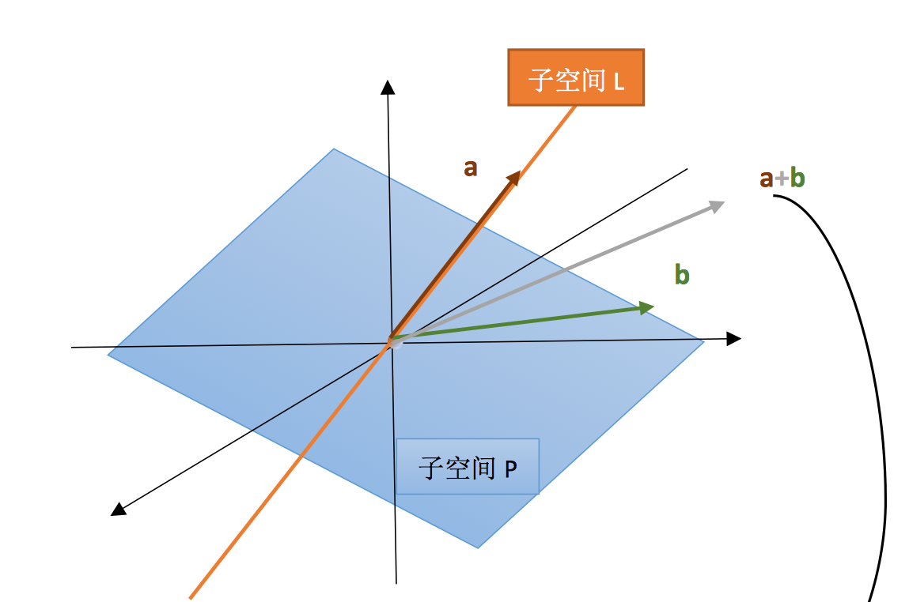
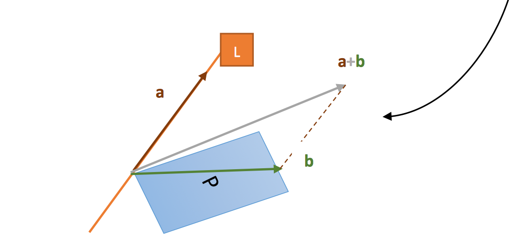

# [Lecture 6： Column Space and Null space](https://ocw.mit.edu/courses/18-06-linear-algebra-spring-2010/resources/lecture-6-column-space-and-nullspace/)

## 1、子空间的“交”与“并”

上一节我们已经介绍过向量空间和子空间的知识，这一节我们我们研究一下“交”和“补”。

### $P \cup L$ 空间

对于$\mathbb{R}^3$的子空间 P 与 L，首先要研究的就是它们的并空间，即：现有一向量集合，包含了 P 与 L 中的所有向量，那么这个向量集合是否构成了子空间呢？

**No!!!**

很明显，我们将直线 L 与平面 P 看做同一个集合 $P \cup L$ 之后，这个集合**对线性运算并不封闭**。

比如我们随便在直线 L 上取一个向量 a，在平面 P 上取一个向量 b。此时向量 a+b 方向就会夹在直线 L 与平面 P 之间，脱离了 $P \cup L$ 的范围。所以 $P \cup L$ 无法构成子空间

### $P \cap L$ 空间

如果看两个子空间的交集，那 $\mathbb{R}^3$ 的例子就再合适不过了。因为P与L相交的部分只有一个地方——原点。很明显原点就是$\mathbb{R}^3$的子空间之一。

那我们现在推广到任意两个子空间的交呢？答案是肯定的。

严格证明（对线性运算封闭）思路如下：\
（1）加法封闭：在 $S \cap T$ 中取 $v, w$ 向量，单看 $S$ 空间，$v, w$ 均在 $S$ 空间里，由于 $S$ 是子空间，对线性运算封闭，故 $\mathrm{v}+\mathrm{w}$ 也在 S 中，同样，再单看 T 空间，将上面的步骤中的 $S$ 换成 $T$ ，也可以得 $v+w$ 在 $T$ 空间中。这就说明 $v+w$ 在 $S \cap T$ 中。所以 $S \cap T$ 对向量加法封闭。\
（2）数乘封闭：在 $S \cap T$ 中取 a 向量，$a$ 在 $S$ 空间中，所以 $n$ 倍的 $a$ 仍在 S 空间中。同样，a 也在 T 空间中，故 n 倍的 a 也在 T 空间中。也就是 $n$ 倍的 a 仍在 $S \cap T$ 中。所以 $S \cap T$ 对数乘运算也是封闭的。

**任意两个子空间的交集一定也能构成一个子空间**。

## 2、列空间 C(A)

通过一个例子来回顾一下列空间。

现在有一个矩阵$A=\left[\begin{array}{lll}1 & 1 &2 \\2 & 1 & 3 \\3 & 1 &4 \\4&1&5\end{array}\right]$，
矩阵的列向量$\left[\begin{array}{l}1 \\2 \\3\\4\end{array}\right],\left[\begin{array}{l}1 \\1 \\1\\1\end{array}\right],\left[\begin{array}{l}2 \\3 \\4\\5\end{array}\right]$均是$\mathbb{R}^4$中的四维向量，
所以**A的列空间是$\mathbb{R}^4$的子空间**。

那么列空间里包含了什么呢？除了这三个列向量，还包含了他们的各种线性组合。也就是说，A的列空间是由这三个列向量张成的一个子空间。

那这个子空间到底有多大呢？这就需要用Ax = b方程来解释了。

### Ax = b 的空间解释（从A的角度）

还是取$A=\left[\begin{array}{lll}1 & 1 &2 \\2 & 1 & 3 \\3 & 1 &4 \\4&1&5\end{array}\right]$。假设有方程Ax = b 如下：

$\mathrm{Ax}=\left[\begin{array}{lll}1 & 1 & 2 \\2 & 1 & 3 \\3 & 1 & 4 \\4 & 1 & 5\end{array}\right]\left[\begin{array}{l}x_1 \\x_2 \\x_3\end{array}\right]=\left[\begin{array}{l}b_1 \\b_2 \\b_3 \\b_4\end{array}\right]=\mathrm{b}$

第一个问题：这个方程是否始终有解？

我们看到，Ax的本质就是对A的列向量进行线性组合：

$\operatorname{Ax}=\left[\begin{array}{lll}1 & 1 & 2 \\2 & 1 & 3 \\3 & 1 & 4 \\4 & 1 & 5\end{array}\right]\left[\begin{array}{l}x_1 \\x_2 \\x_3\end{array}\right]=x_1\left[\begin{array}{l}1 \\2 \\3 \\4\end{array}\right]+x_2\left[\begin{array}{l}1 \\1 \\1 \\1\end{array}\right]+x_3\left[\begin{array}{l}2 \\3 \\4 \\5\end{array}\right]$

或者可以认为，Ax代表着A的列空间。

显然，三个四维向量的线性组合是无法铺满整个四维空间的，就如同两个三维向量无法张成一个三维空间一样。所以，这里的Ax 只能是$\mathbb{R}^4$空间的部分子空间。也就是说，无法保证任意拿出一个四维向量b = $\left[\begin{array}{l} b_1\\b_2\\b_3\\b_4\end{array}\right]\in \mathbb{R}^4$，都能找到A列向量的一种线性组合，使Ax = b。

第二个问题：什么样的 b 可以使方程 Ax = b 有解？

根据上面的描述，只有 b 在”**A 的列空间**“这个$\mathbb{R}^4$的子空间中，才可以找到一种A列向量的线性组合来构成b。也就是使得方程有解。

第三个问题：能否去掉 A 的一列，却不影响 A 的列空间呢？

回到这三个列向量中$\left[\begin{array}{l}1 \\2 \\3\\4\end{array}\right],\left[\begin{array}{l}1 \\1 \\1\\1\end{array}\right],\left[\begin{array}{l}2 \\3 \\4\\5\end{array}\right]$。很显然第三列可以写成前两列的线性组合，也就说第三列对线性组合没有任何的贡献。我们仅依靠前两列的线性组合也可以构成 A 的整个列空间。我们称$\left[\begin{array}{l}1 \\2 \\3\\4\end{array}\right],\left[\begin{array}{l}1 \\1 \\1\\1\end{array}\right]$这样的列为主列。所以去掉第三列，并不影响 A 的列空间的构成。

综上，**C(A)是四维向量空间的一个二维子空间**。

> **对于矩阵$A_{m \times n}$而言，其列空间为 m 维向量空间$\mathbb{R}^m$的一个子空间**。

# 3、零空间 N(A)

## 零空间介绍

所谓零空间，就是 **Ax = 0 的所有解构成的一个空间**。

还是以$A=\left[\begin{array}{lll}1 & 1 &2 \\2 & 1 & 3 \\3 & 1 &4 \\4&1&5\end{array}\right]$为例，他的零空间就是下面这个方程的解构成的空间：

$Ax=\left[\begin{array}{lll}1 & 1 & 2 \\2 & 1 & 3 \\3 & 1 & 4 \\4 & 1 & 5\end{array}\right]\left[\begin{array}{l}x_1 \\x_2 \\x_3\end{array}\right]=\left[\begin{array}{l}0 \\0 \\0 \\0\end{array}\right]=0$

也就是 $\mathrm{x}=\left[\begin{array}{l}x_1 \\x_2 \\x_3\end{array}\right]$，可以看到 x 有三个分量，所以其零空间是$\mathbb{R}^3$的子空间。

所以，对于 $m \times n$ 的矩阵来说，列空间是$\mathbb{R}^m$的子空间，零空间是$\mathbb{R}^n$的子空间。

列空间关键在于列向量的维数，零空间关键在于列向量的个数。

首先来验证这样的 $\left[\begin{array}{l}x_1 \\ x_2 \\ x_3\end{array}\right]$ 为什么能构成向量空间？\
（1）加法封闭：在此零空间中任取两向量 $v$ ，$w$ ，有 $A v=A w=0$ ，很显然 $A(v+w)=0$ ，所以 $(v+w)$ 也属于零空间，加法封闭得证。\
（2）数乘封闭：还是，在此零空间中任取向量 $v, A v=0$ ，则 $c A v=0$ 。矩阵 $A$ 与常数 $c$ 位置可交换，所以 $A(cv)=0$ ．所以 $cv$ 也在零空间中。数乘运算封闭得证。

【例】求上面 $\mathrm{A}=\left[\begin{array}{lll}1 & 1 & 2 \\ 2 & 1 & 3 \\ 3 & 1 & 4 \\ 4 & 1 & 5\end{array}\right]$ 的零空间。
我们讨论过，这个 A 的第三列可以写成前两列的线性组合，所以可以写出令 $A x=0$ 的一个解：$\left[\begin{array}{c}1 \\ 1 \\ -1\end{array}\right]$ ，而其零空间即为：$C\left[\begin{array}{c}1 \\ 1 \\ -1\end{array}\right]$（C 表示任意常数）。反映在图像上，就是 $R^3$ 中的一条穿过原点的直线。

## Ax = b 的空间解释（从 x 的角度）

如果上面构造零空间的方程右侧变为任意向量的话，其解集 x 还能构成向量空间吗？

如：

$\left[\begin{array}{lll}
1 & 1 & 2 \\
2 & 1 & 3 \\
3 & 1 & 4 \\
4 & 1 & 5
\end{array}\right]
\left[\begin{array}{l}
x_1 \\
x_2 \\
x_3
\end{array}\right]=
\left[\begin{array}{l}
1 \\
2 \\
3 \\
4
\end{array}\right]$

这样的所有 x 构成的解集还是向量空间吗？
显然不是。将 $\left[\begin{array}{l}x_1 \\ x_2 \\ x_3\end{array}\right]=\left[\begin{array}{l}0 \\ 0 \\ 0\end{array}\right]$ 代入，其显然不是这个方程的解，就是说明这个解集里根本没有零向量。之前我们学过，任何一个向量集合中必须要有零向量。歼是说明这个解集连最基本的要求都无法满足，构不成向量空间。

反映在图像上，这里所有的 $\left[\begin{array}{l}x_1 \\ x_2 \\ x_3\end{array}\right]$ 其实构成的是一个不过原点的平面。
这也告诉我们，想从 x 的角度研究 $\mathrm{Ax}=\mathrm{b}$ 这个方程，则只有 b 是零向量寸，$x$ 才能构成空间（零空间），其他情况中连零向量都不在解集中，更别谈向量空间了。

> 对于矩阵$A_{m \times n}$而言，其零空间为 n 维向量空间$\mathbb{R}^n$的一个子空间。