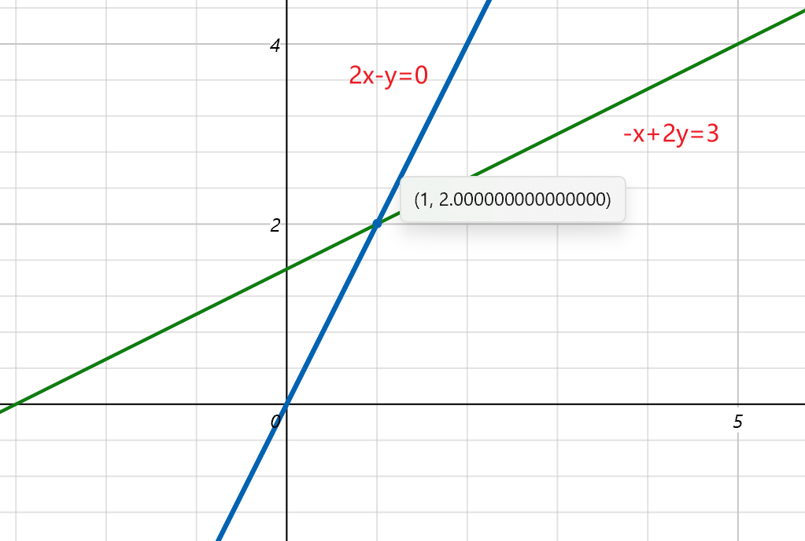
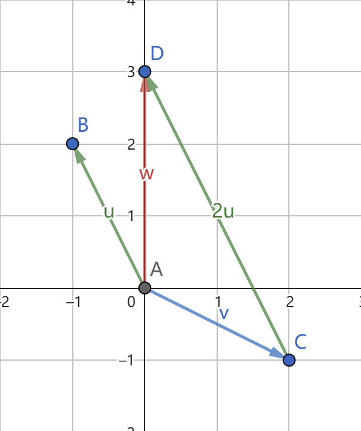
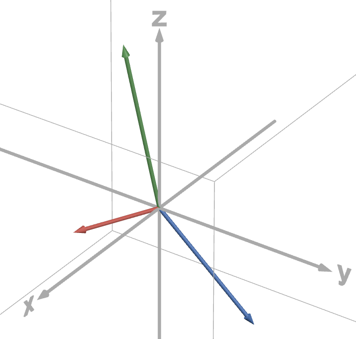

# [Lecture 1：The geometry of linear quations](https://ocw.mit.edu/courses/18-06-linear-algebra-spring-2010/resources/lecture-1-the-geometry-of-linear-equations/)

## 1、Overview

学习线性代数的应用之一就是**求解复杂的方程问题**，所以第一节就从**解方程**开始。

本节的核心内容是从 **row picture** 和 **column picture** 的角度求解方程组。

- **row picture**:将方程的行向量抽离出来，画出其 row picture， 通过画图的方式求出方程组的解。本质上来说，row picture 其实就是一种作图求解，2-dim row picture 就是两条直线的交点，3-dim row picture 就是两个平面的交线等等。
- **column picture**:将方程组表示为 $xA+yB = b$ 的形式，也就是将方程转化为列向量$A,B$的线性组合。此时，求解方程组转化为了找到合适的一组$(x,y)$，使得列向量$A,B$能够合成向量$b$。

## 2、方程组的几何解释基础

### Row Picture（矩阵的角度）

下面是一个关于二维方程组的简单的例子（2个未知数，2个方程）。

$\left\{\begin{array}{c}2 x-y=0 \\ -x+2 y=3\end{array}\right.$

我们首先按照row将方程组写成矩阵的形式：

$\begin{aligned}&\left[\begin{array}{cc}2 & -1 \\-1 & 2\end{array}\right]\left[\begin{array}{l}x \\y\end{array}\right]=\left[\begin{array}{l}0 \\3\end{array}\right]\\&\text { \ \ \ 系数矩阵 \ 未知向量 \ \ 向量 }\end{aligned}$

> **系数矩阵(A)**:将方程组系数按行提取出来，构造出的一个矩阵。
**未知向量(X)**:将方程组的未知数提取出来，构成的一个列向量。
**向量(B)**:将等号右边的结果按照列提取出来，构成的一个列向量。
因此，原方程组可以表示为：$Ax = b$
> 

构造完矩阵后，我们可以将对应的 **row picture** 画出来。

所谓的 **row picture**，跟我们在中学时的画图一样，在平面直角坐标系$XOY$中做出$2 x-y=0$和$-x+2 y = 3$的图像（也就是两条直线），他们的交点也就是我们要找的$(x,y)$。

### Column Picture (向量的角度)

还是以上面的方程为例，

$\left\{\begin{array}{c}2 x-y=0 \\ -x+2 y=3\end{array}\right.$

但是这一次我们将按照列提取

$x\left[\begin{array}{c}2 \\-1\end{array}\right]+y\left[\begin{array}{c}-1 \\2\end{array}\right]=\left[\begin{array}{l}0 \\3\end{array}\right]$

这样，我们就将问题转化成了：将向量$\left[\begin{array}{c}2 \\-1\end{array}\right]$与向量$\left[\begin{array}{c}-1 \\2\end{array}\right]$进行合理的组合，使其构成向量$\left[\begin{array}{l}0 \\3\end{array}\right]$，这个过程被称为列向量的线性组合（Linear Combination of Columns）。

下面我们使用 column picture 将方程组展现出来，并求解：

从图中很明显的看出，$\vec{v}+2\vec{u}$ 满足条件。

<aside>
💡

这里不妨想一下，如果我们任取$(x,y)$，很明显会得到任意方向的向量，这些向量能够布满整个平面吗？
从空间的角度看，任取$(x,y)$可以得到矩阵A的列向量的所有线性组合，这些线性组合构成了矩阵A的**列空间（Column Space）**，这个列空间构成了整个**二维实空间**$\mathbb{R}^2$。
从方程的角度看，对于任意的向量 $b$，$Ax=b$ 始终有解。

</aside>

## 3、方程组的几何解释推广

### High-dimensional Row Picture（高维行图像）

我们将方程组的维数推广到三维，给定三维矩阵如下：

$\left\{\begin{array}{c}2 x-y=0 \\-x+2 y-z=-1 \\-3 y+4 z=4\end{array}\right.$

还是写出这个方程组的矩阵表达形式：

$\left[\begin{array}{ccc}2 & -1 & 0 \\-1 & 2 & -1 \\0 & -3 & 4\end{array}\right]\left[\begin{array}{l}x \\y \\z\end{array}\right]=\left[\begin{array}{c}0 \\-1 \\4\end{array}\right]$

其中，$\mathrm{A}=\left[\begin{array}{ccc}2 & -1 & 0 \\-1 & 2 & -1 \\0 & -3 & 4\end{array}\right], \quad \mathrm{b}=\left[\begin{array}{c}0 \\-1 \\4\end{array}\right]$。

学过微积分的人都知道，当我们将维数扩展到三维时，row picture 就不是那么直观了，因为每一个方程所对应的图像不再是一个简单的直线，而是一个平面，三个平面之间的关系是很难用图像直观的体会到的。

如果执意想要绘制 row picture，比较靠谱的思路是先联立其中两个平面，使其相交于一条直线，再研究这条直线与平面相交于哪个点，最后得到点坐标即为方程的解。

这个求解过程对于三维来说或许还算合理，那四维呢？五维甚至更高维数呢？

直观上**很难直接绘制更高维数的图像，这种行图像受到的限制也越来越多**。

### High-dimensional Column Picture（高维列图像）

我们使用上面同样的例子：

$\left\{\begin{array}{c}2 x-y=0 \\-x+2 y-z=-1 \\-3 y+4 z=4\end{array}\right.$

如果我们使用列图像的思路进行计算，那矩阵形式就变为：

$x\left[\begin{array}{c}2 \\-1 \\0\end{array}\right]+y\left[\begin{array}{c}-1 \\2 \\-3\end{array}\right]+z\left[\begin{array}{c}0 \\-1 \\4\end{array}\right]=\left[\begin{array}{c}0 \\-1 \\4\end{array}\right]$

左侧是（矩阵列向量的）线性组合，右侧是线性组合得到的结果，这样一来思路就清晰多了，“寻找正确的线性组合”成为了解题关键。

很明显，我们只需要取 **x = 0, y = 0, z = 1** 就得到了结果，这在**Row Picture**之中并不明显。

使用 **Column Picture** 求解方程， 其优势在于这种求解方法高阶系统，只需**寻找正确的线性组合**，而不用绘制每个行方程的图像之后寻找那个很难看出来的点。

另外一个优势在于这种方法更加灵活，如果我们改变向量 **b**，如改为：

$x\left[\begin{array}{c}2 \\-1 \\0\end{array}\right]+y\left[\begin{array}{c}-1 \\2 \\-3\end{array}\right]+z\left[\begin{array}{c}0 \\-1 \\4\end{array}\right]=\left[\begin{array}{c}1 \\1 \\-3\end{array}\right]$

只需要重新寻找一个线性组合就够了，但是如果我们使用的是行图像呢？那意味着我 们要完全重画三个平面图像，就简便性来讲，两种方法高下立判。

<aside>
💡

那么，对任意的 **b** 是不是始终能够求解 **Ax = b** 这个矩阵方程呢？

从空间的角度来看，这个问题本质上是问我们对于这个3*3的系数矩阵A，其列的线性组合是否可以覆盖整个三维空间？

对于上面这个例子，答案是可以的，因为这些列向量是相互**独立的(Independent)**。但并不是所有的矩阵都可以，这个后面会讲。

</aside>

### 矩阵乘法

对于$Ax$，也就是一个矩阵A和一个向量x的乘积，我们可以通过两个角度来看。

在此之前，让我们假设 $A=\left[\begin{array}{ll}2 & 5 \\1 & 3\end{array}\right], \quad x=\left[\begin{array}{l}1 \\2\end{array}\right]$

- 角度1：$Ax$ is a combination of columns of matrix A（ 💥）

$\left[\begin{array}{ll}2 & 5 \\1 & 3\end{array}\right]\left[\begin{array}{l}1 \\2\end{array}\right]=1\left[\begin{array}{l}2 \\1\end{array}\right]+2\left[\begin{array}{l}5 \\3\end{array}\right]=\left[\begin{array}{c}12 \\7\end{array}\right]$
- 角度2：$Ax$ is a combination of rows of matrix A

$\left[\begin{array}{ll}2 & 5 \\1 & 3\end{array}\right]\left[\begin{array}{l}1 \\2\end{array}\right]=\left[\begin{array}{l}(2,5) \cdot(1,2) \\(1,3) \cdot(1,2)\end{array}\right]=\left[\begin{array}{l}
2 * 1+5 *2 \\
1 * 1+3 * 2
\end{array}\right]=\left[\begin{array}{c}12 \\7\end{array}\right]$

## 4、小结

这部分内容主要是对线性代数概念的初步了解。

从解方程谈起，从行空间逐步过渡到列空间，可以看到从列空间角度求解方程可以将解方程问题转化为求列向量的线性组合的问题。

最后，从列向量与行向量的角度介绍一下矩阵乘法。