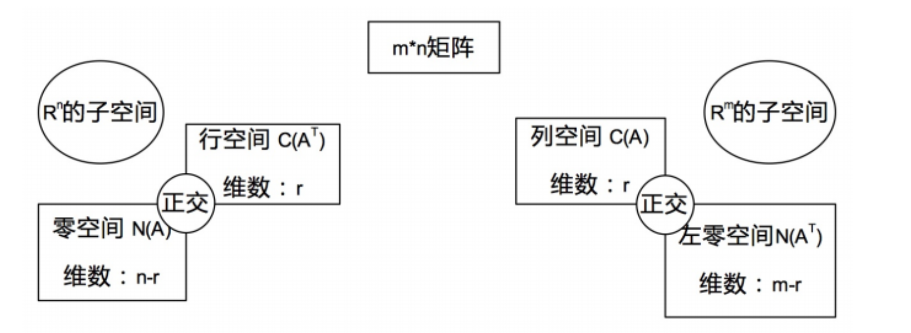

# [Lecture 14: Orthogonal vectors and subspaces](https://ocw.mit.edu/courses/18-06-linear-algebra-spring-2010/resources/lecture-14-orthogonal-vectors-and-subspaces/)

一图胜千言：

本节的所有内容都在阐释上面这张图。

## 正交

何为正交？从空间角度来看，正交就是垂直。无论是两个向量之间的正交，还是空间的正交，它们在线性代数中都意味着：垂直。

### 向量正交

如图，$x$ 和 $y$ 两个向量相互垂直，根据中学知识，我们知道两个向量垂直则意味着这两个向量的内积为0，即：$x^Ty=0$。

这一结论可以用勾股定理来证明：
$|x|^2 + |y|^2 = |x+y|^2$
易知：$x^Tx + y^Ty = (x+y)^T(x+y)$
得到：$0 = x^Ty + y^Tx$
易知$x^Ty = y^Tx$，故：$2x^Ty = 0$
得到：$x^Ty = 0$

进一步，如果两个向量中其中某一个是零向量，那这两个向量一定正交。

### 空间正交

所谓空间的正交，就是：一个空间中的任意一个向量，都与另一个空间中的任意一个向量正交。

直觉上，我们可能会误以为三维直角坐标系中如xy平面xz平面正交，但实际上它们并不正交。这一点很容易证伪，我们选择两个平面交线x轴上的向量，任取两个，显然它们并不垂直。

> 反过来，这一事实也意味着：如果两个平面在某个非零向量处相交，那么它们一定不正交。
> 

那么怎么样的两个空间可能会正交呢？我们先从 $\mathbb{R}^2$ 的子空间来分析，一个平面上的子空间有：

- 整个平面 P
- 平面上任意过原点的直线 L
- 原点零向量

P与L永远不可能正交；当$L_1$与$L_2$在原点处垂直时，$L_1$和$L_2$正交；L与0永远正交。

高维空间也可以由此继续做推理。

### 矩阵子空间的正交

回归到矩阵，为什么我们可以笃定零空间和行空间是正交的呢？实际上我们只需要从行视角和零空间视角分别来看$Ax=0$即可窥得端倪：

$$
Ax = \begin{bmatrix} \text{row1 of A} \\ \text{row2 of A} \\ \text{row3 of A} \\ \vdots \\ \text{rowm of A} \end{bmatrix} \begin{bmatrix} x_1 \\ x_2 \\ x_3 \\ \vdots \\ x_n \end{bmatrix} = \begin{bmatrix} \text{row1 of A} \cdot x \\ \text{row2 of A} \cdot x \\ \text{row3 of A} \cdot x \\ \vdots \\ \text{rown of A} \cdot x \end{bmatrix} = \begin{bmatrix} 0 \\ 0 \\ 0 \\ \vdots \\ 0 \end{bmatrix}
$$

从行视角看，A中每个行向量与向量x的内积都是0，而从零空间视角看，x可以是零空间任意一个向量，因此，这就意味着A中的每个行向量都与零空间的任意向量垂直。此外，行空间的所有向量都是由A中行向量线性组合得到，因此无论怎么组合，都无非表示成诸如$c \cdot \text{row1} + d \cdot \text{row2} + ... + z \cdot \text{rowm}$，结果依然是0。

**由此证得矩阵的行空间与零空间正交。同理，我们对矩阵进行转置，可以得到列空间与左零空间正交。**

此外，行空间和零空间的关系，更像是把一个空间一分为二所得到的两个子空间：

- 行空间与零空间的维数之和是n
    - 行空间维数是r，零空间维数是 $n-r$
    - 它们都是 $\mathbb{R}^n$ 的子空间。
- 列空间与左零空间的维数之和是m
    - 列空间维数是r，左零空间维数是$m-r$
    - 它们都是 $\mathbb{R}^m$ 的子空间。

进一步，我们把行空间和零空间称作为 $\mathbb{R}^n$ 中的正交补，列空间和左零空间称为 $\mathbb{R}^m$ 中的正交补。

> 所谓正交补，就是指对于一个空间S，另一个空间T囊括了所有垂直于S的向量而不是局部，这里的一分为二描述的是一种彻底程度。

## 无解方程的最优解

现实世界中，矩阵的数据源于测量，测量就难免有误差甚至错误，从而导致$Ax=b$无解。

什么样的$Ax=b$有解呢？我们知道A得是可逆的，当m很大，n很小时，我们可以通过不断的移除某些行，丢弃这些坏数据，让方程有解。这听上去是个合理的方法，但实际上却难以执行。为什么呢？因为我们根本无法判断究竟哪些行是脏数据。

对于这一困难，工程上常常会进行妥协：我们可以去求近似的最优解，类似于一种拟合。

怎么求近似解呢？在已知$Ax=b$无解的前提下，我们可以尝试在方程两侧同时左乘$A^T$，无解方程就变成$A^TAx^*=A^Tb$。

> 这里的$x^*$不是解x，x已经是无解的了，这里只是尝试找到一个近似解。

通过前面课程的学习，我们知道$A^TA$矩阵是一种对称方阵，此时如果$A^TA$可逆，那么解$x^*$就容易求得。

然而$A^TA$也不见得就可逆，怎么去判断$A^TA$是否可逆呢？先说结论：当A中各列线性相关时，$A^TA$不可逆。

为了证明这一点，需要先得到两个性质：

1. $N(A^TA)=N(A)$：二者具有相同的零空间。
    - 对于$A^TAx=0$,有：$x^TA^TAx=(Ax)^T(Ax)=0$，因此 $Ax=0$
2. $rank(A^TA)=rank(A)$：二者具有相同的秩。
    - 由性质1可知二者零空间维数相同，且二者具有相同的列数，因此秩相等。

而$A^TA$若可逆，则意味着$N(A^TA)$只有零向量，既然$N(A)$与$N(A^TA)$相同，也就意味着$N(A)$中也只能有零向量，此时，A中各列线性无关。证毕。