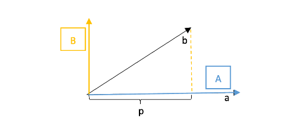

# [Lecture 17: Orthogonal matrices and Gram-Schmidt](https://ocw.mit.edu/courses/18-06-linear-algebra-spring-2010/resources/lecture-17-orthogonal-matrices-and-gram-schmidt/)

## 标准正交基

标准正交向量组构成的空间基被称为标准正交基，它有两个特性：对标准正交向量组中任意向量q，有：

$$
q_i^Tq_j = \begin{cases} 0 & (i \neq j) \\ 1 & (i = j) \end{cases}
$$

即：向量彼此垂直，模均为1。

## 标准正交矩阵

将标准正交向量组中的 $q₁, q₂, ..., qₙ$ 组成的矩阵 $Q$ 被称为正交矩阵：

$$
Q = [q_1 \space q_2 \space q_3 \space ... \space q_n]
$$

显然，正交矩阵 $Q$ 具有一个良好的性质：

$$
Q^TQ = \left[\begin{matrix}{}q_1\\q_2\\q_3\\\dots\\q_n\end{matrix}\right]\left[\begin{matrix}{}q_1&q_2&q_3&\dots&q_n\end{matrix}\right]=\left[\begin{matrix}{}1&0&\dots&0&0\\0&1&\dots&0&0\\\dots&\dots&\dots&\dots&\dots\\0&0&\dots&1&0\\0&0&\dots&0&1\end{matrix}\right]=I
$$

### 正交矩阵

**特别地，当 $Q$ 为方阵时，我们称这样的 $Q$ 为正交矩阵。**

正交矩阵有更丰富的性质，此时的方阵 $Q$  有逆矩阵，由$Q^TQ=I$可知，$Q^{−1}=Q^T$。

> 置换矩阵就是个经典案例。

### 标准正交矩阵的应用

标准正交矩阵可应用于投影矩阵。对于投影矩阵：

$$
P = A(A^TA)^{-1}A^T
$$

当 $A$ 是标准正交矩阵 $Q$ 时，有：

$$
P = Q(Q^TQ)^{-1}Q^T = QQ^T
$$

特别地，若 $Q$ 为方阵：

$$
QQ^T = QQ^{-1} = I
$$

此时投影矩阵即为单位阵 $I$。

对于 $P = QQ^T$，有以下特性：

- 是对称阵：
    
    $$
    P = P^T
    $$
    
- 乘方不变性：
    
    $$
    P^2 = P
    $$
    

对于拟合方程：

$$
A^TA\hat{x} = A^Tb
$$

若A为标准正交矩阵，方程简化为：

$$
\hat{x} = Q^Tb
$$

其中每个分量：

$$
\hat{x}_i = q_i^Tb
$$

> 物理意义：对已知标准正交基，向量  $b$ 在第 $i$ 个基上的投影为对应基向量与 $b$ 的内积 $q_i^Tb$。
> 

因此，选择标准正交向量组作为基时，投影矩阵相关计算得到极大简化。

## Gram-Schmidt正交化

在标准正交矩阵的应用中我们可以看到，如果能够在实际运算中采用标准正交向量组，那就可以简化相当多的运算量。然而实际情况是，我们往往拿到的都只是一组线性无关的向量，它们恰好构成标准正交基的可能性微乎其微。那么有没有一种方法，可以将任意的线性无关向量组转换为标准正交基呢？

**答案是肯定的，这种方法就是"Gram-Schmidt正交化"。**

Gram-Schmidt正交化的过程很简单：

线性无关向量 $a,b$ → 正交向量 $A,B$ → 标准正交向量 $q_1=\frac{A}{||A||},q_2=\frac{B}{||B||}$

> 第一步转为正交向量的过程被称作Graham，第二步标准化为模1的过程被称作Schmidt。
> 

第二步标准化的过程很好理解，对每个分量除以模量即可，正交化的过程关键在于第一步，怎么找到$A$和$B$。

以不共线的两个$a,b$向量为例，怎么转换成正交基呢？这就要用到投影：

我们先将a向量固定，设为A，然后将b向量投影到A上得到p，此时误差向量e=b−p所在直线的方向实际上就是另一个基向量B的方向，取投影长度为B的长度。于是有：

$$
B = b - \frac{A^Tb}{A^TA}A
$$

式子里A^Tb和A^TA都是内积标量值。得到A,B之后，第二步就是做标准化：

$$
q_1 = \frac{A}{||A||}, q_2 = \frac{B}{||B||}
$$

延展到三维空间，对于向量a,b,c要怎么做正交化呢？我们可以如法炮制，首先A,B的寻找方法不变：

$$
A = a, B = b - \frac{A^Tb}{A^TA}A
$$

C的计算如出一辙，我们分别让c在A和B上进行投影，然后再减去投影得到的两个向量即为C：

$$
C = c - \frac{A^Tc}{A^TA}A - \frac{B^Tc}{B^TB}B
$$

最后再对A,B,C标准化即可。

> 因为 A、B 都是线性无关的，那么 A、B 显然可以构成一个平面（这里我们以三维空间为例，高维空间类似）所以我们分别做向量 $c$  在 A、B 上的投影，我们记为 $c_a=\frac{A^Tc}{A^TA}A,\ c_b=\frac{B^Tc}{B^TB}B$。要想做出 C 同时垂直于 A、B ，即 C 垂直于 A、B 构成的平面，也就要做出 C 在这个平面上的投影，而这个投影，其实就是 $c_a + c_b$。
所以，我们要求的 $C = c - (\frac{A^Tc}{A^TA}A + \frac{B^Tc}{B^TB}B) = c - \frac{A^Tc}{A^TA}A - \frac{B^Tc}{B^TB}B$
> 

### 示例

有 $a=\left[\begin{matrix}1\\1\\1\end{matrix}\right]$, $\left[\begin{matrix}1\\0\\2\end{matrix}\right]$，求标准正交矩阵 $Q$。

解：

先固定 $A=a=\left[\begin{matrix}1\\1\\1\end{matrix}\right]$，用 $b$ 在 $A$ 上投影，差值即为：

$$
B = b - \frac{A^Tb}{A^TA}A = \left[\begin{matrix}1\\0\\2\end{matrix}\right] - \frac{3}{3}\left[\begin{matrix}1\\1\\1\end{matrix}\right] = \left[\begin{matrix}0\\-1\\1\end{matrix}\right]
$$

标准化后得到：

$$
Q = \begin{bmatrix} \frac{1}{\sqrt{3}} & 0 \\ \frac{1}{\sqrt{3}} & -\frac{1}{\sqrt{2}} \\ \frac{1}{\sqrt{3}} & \frac{1}{\sqrt{2}} \end{bmatrix}
$$

## 引申：矩阵的QR分解

从消元法的角度看，矩阵A可以分解为 $A=LU$，其中 $L$ 是进行行变换的下三角矩阵，$U$ 是上三角矩阵。

类似地，Gram-Schmidt正交化可以表示为 $A=QR$，其中 $Q$ 为标准正交矩阵，$R$ 是上三角矩阵：

$$
[a_1 \space a_2] = [q_1 \space q_2]\begin{bmatrix}a_1^Tq_1 & a_2^Tq_1 \\ 0 & a_2^Tq_2\end{bmatrix}
$$

注意到 $R$ 矩阵左下角为0（因为$a₁⊥q₂$）。推广到高维时，$R$  矩阵的下三角部分均为0，这是因为在Gram-Schmidt正交化过程中，后构造的向量总是垂直于之前的所有向量。