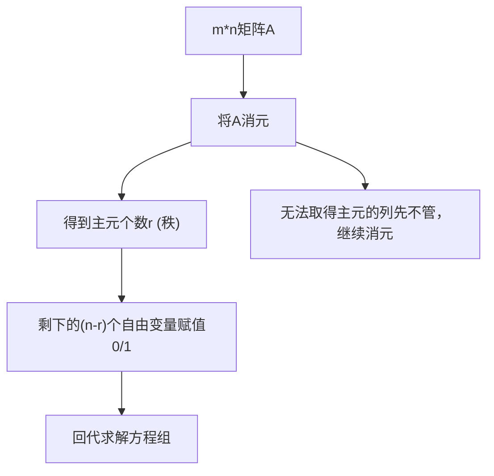

# [Lecture 7： Solving Ax = 0 Pivot Variables, Special Solutions](https://ocw.mit.edu/courses/18-06-linear-algebra-spring-2010/resources/lecture-7-solving-ax-0-pivot-variables-special-solutions/)

## 1、求解方程 Ax = 0 ：消元法求解零空间

### 消元：消元法确定主变量与自由变量（A → U）

【例】设 $\mathrm{A}=\left[\begin{array}{llcc}1 & 2 & 2 & 2 \\ 2 & 4 & 6 & 8 \\ 3 & 6 & 8 & 10\end{array}\right]$ ，求由 $\mathrm{Ax}=0$ 中的 x 构成的零空间。

$\mathrm{Ax}=0$ 其实就是一个方程组：
$\left[\begin{array}{cccc} 1 & 2 & 2 & 2 \\ 2 & 4 & 6 & 8 \\ 3 & 6 & 8 & 10 \end{array}\right]\left[\begin{array}{l} x_1 \\ x_2 \\ x_3 \\ x_4 \end{array}\right]=0$

还是之前学过的消元法来直接处理矩阵 A ：

$$\left[\begin{array}{cccc} 1 & 2 & 2 & 2 \\ 2 & 4 & 6 & 8 \\ 3 & 6 & 8 & 10 \end{array}\right] \rightarrow\left[\begin{array}{llll} \color{red}1 & 2 & 2 & 2 \\ 0 & 0 & 2 & 4 \\ 0 & 0 & 2 & 4 \end{array}\right] \rightarrow\left[\begin{array}{llll} \color{red}1 & 2 & 2 & 2 \\ 0 & 0 & \color{red}2 & 4 \\ 0 & 0 & 0 & 0 \end{array}\right]=U$$

首先注意 A 矩阵消元之后只有两个主元： **1** 和 **2** ，主元的个数被称为 **秩**, 即 $A$ 的秩（ $rank$ ）为： 2

接下来应该是进行回代求解了，但是在这之前，由于消元得到的 U 不是一个严格的上三角矩阵：$\left[\begin{array}{llll}\color{red}1 & 2 & 2 & 2 \\ 0 & 0 & \color{red}2 & 4 \\ 0 & 0 & 0 & 0\end{array}\right]$。
对角线上的 0 给我们造成了解不唯一的麻烦。所以先来明确几个概念：

- 主列：主元所在的列被称作主列，在这里是
$\left[\begin{array}{l}\color{red}1\\0\\0 \end{array}\right],\left[\begin{array}{l}2\\\color{red}2\\0 \end{array}\right]$
- 自由列：除了主列的其他列都被称作自由列。所谓自由列，就表示其对应的未知变量 $x_n$（ n 表示自由列是第 n 列）可以被任意分配值。因为回代求解时只有主元列对应的未知数的解有确定值。所以其＂自由＂就代表着可以任意赋值

**所以这个 U 的主变量（主元）为$x_1,x_3$**。**自由变量为$x_2,x_4$**。

### 回代：对自由变量进行赋值，覆盖零空间

首先给自由变量 $[x_2 \quad x_4]^T$ 赋值为 $[1 \quad 0]^T$。
回代入方程组：
$\begin{cases}
x_1 + 2x_2 + 2x_3 + 2x_4 = 0 \\
2x_3 + 4x_4 = 0
\end{cases}$
当 $[x_2 \quad x_4]^T = [1 \quad 0]^T$ 时，解向量为：$\begin{bmatrix}-2\\1\\0\\0\end{bmatrix}$

再给自由变量 $[x_2 \quad x_4]$ 赋值为 $[0 \quad 1]^T$。
再次回代入方程组：
$\begin{cases}
x_1 + 2x_2 + 2x_3 + 2x_4 = 0 \\
2x_3 + 4x_4 = 0
\end{cases}$
这次当 $[x_4 \quad x_2] = [0 \quad 1]^T$ 时，解向量为：$\begin{bmatrix}2\\0\\-2\\1\end{bmatrix}$

还有别的给$\begin{bmatrix}x_2\\x_4\end{bmatrix}$赋值的方法吗？很明显其余的赋值方法都可以被$\begin{bmatrix}1\\0\end{bmatrix}$和$\begin{bmatrix}0\\1\end{bmatrix}$ 的线性组合所覆盖，所以这两个解向量足够代表零空间的特征了。对于$\begin{bmatrix}-2\\1\\0\\0\end{bmatrix},\begin{bmatrix}2\\0\\-2\\1\end{bmatrix}$这两个特殊的解向量，我们称这两个解向量为：特解。其特殊之处在于给自由变量赋值为了$\begin{bmatrix}1\\0\end{bmatrix}$和$\begin{bmatrix}0\\1\end{bmatrix}$。\
通过**特解的任意倍的线性组合可以构造出整个零空间**。
即 $\begin{cases} \mathrm{Ax= 0}\text{ 的 所 有 解 }\\ \mathrm{Ax= 0}\text{ 中 的  x 构 成 的 零 空 间 }& & \end{cases}$为：

$$\mathrm{x~=~c}\begin{bmatrix}-2\\1\\0\\0\end{bmatrix}+d\begin{bmatrix}2\\0\\-2\\1\end{bmatrix}$$

### 算法总结

对于一个 $m \times n$ 的矩阵 A ，他的秩(Rank)为r，那么就意味着其主变量为 r 个，而自由变量为 n-r 个。也就是只有 r 个方程起作用，而一共有 n 个变量 x ，我们将其中的 n-r 个自由变量依次赋值为

$\begin{bmatrix}1\\0\\0\\ \cdots \\0\end{bmatrix},\begin{bmatrix}0\\1\\0\\ \cdots \\0\end{bmatrix},\cdots,\begin{bmatrix}0\\0\\0\\ \cdots \\1\end{bmatrix}$。按下来解方程求特解，将特解的任意倍进行线性组合就可以了。

## 2、化简行阶梯形式（U → R）

上面的消元法看上去已经很完美了，但是最后一步解方程还有化简的余地，
最后得到的 U 矩阵还可以被进一步化简。

拿上面的U矩阵$\begin{bmatrix}\color{red}1&2&2&2\\0&0&\color{red}{2}&4\\0&0&0&0\end{bmatrix}$为例，继续化简：

- 首先向上消元，使主元列**除主元之外都是**$0$:
$$\begin{bmatrix}\color{red}1&2&0&-2\\0&0&\color{red}{2}&4\\0&0&0&0\end{bmatrix}$$
- 提出一列元素公倍数，使主元均为1：
$$2\begin{bmatrix}\color{red}1&2&0&-2\\0&0&\color{red}{2}&4\\0&0&0&0\end{bmatrix}$$

> 这就是简化行阶梯形式，将原来的行阶梯型矩阵简化，得到主列，自由列的最简单形式。

- 列交换，使左上角变为单位阵$I$：
$2\begin{bmatrix}\color{red}1&0&2&-2\\0&\color{red}{1}&0&2\\0&0&0&0\end{bmatrix}$

显然，倍数2可以略去不看，不影响我们的解（我们在某一行方程两边同时除以相同的数，方程的解是不变的）。\
此时的$R = \begin{bmatrix}\color{red}1&0&2&-2\\0&\color{red}{1}&0&2\\0&0&0&0\end{bmatrix}$。

也就是说$m \times n$ 的A可以被化简为如下形式：

$$R = \begin{bmatrix}\color{red}I&\color{green}F\\\color{red}0&\color{green}0\end{bmatrix}$$

- 第一列为主列：其中$I_{r\times r}$，r 为秩。
- 第二列称为自由列，有 n - r 个自由列。

对比上面的$R=\begin{bmatrix}\color{red}1&0&2&-2\\0&\color{red}1&0&2\\0&0&0&0\end{bmatrix}$，很好理解 R 的构成。左上角 I 是消元化简之后得到的 **$r \times r$ 大小的单位阵**，代表着主列。右上角的 F 代表着自由列经过化简剩余的形式。
现在假设有一个 **零空间矩阵**：即零空间矩阵各列由特解组成，记 N 为零空间矩阵。\
联系之前学习矩阵乘法时学到的分块乘法，不难得到：

$$Ax = Rx = \left[\begin{matrix} I_{n \times n} & F_{(n-r)\times(n-r)} \\ 0 & 0 \end{matrix}\right]\left[\begin{matrix} x_{主元} \\ x_{自由变量} \end{matrix}\right] = RN = 0$$

得到：

$$零空间矩阵 N = \left[\begin{matrix} -F \\ I \end{matrix}\right]$$

其中$I_{(n-r) \times (n-r)}$ 这个单位阵是将 $(n-r)$ 个自由变量分别赋值 $0/1$ 得到的。

再对比上面的例子 $R = \left[\begin{array}{ll:ll} \color{red}1 & 0 & 2 & -2 \\ 0 & \color{red}1 & 0 & 2 \\ \hdashline 0 & 0 & 0 & 0 \end{array}\right]$，其对应零空间矩阵 $N = \left[\begin{matrix} -2 & 2 \\ 0 & -2 \\ 1 & 0 \\ 0 & 1 \end{matrix}\right]$