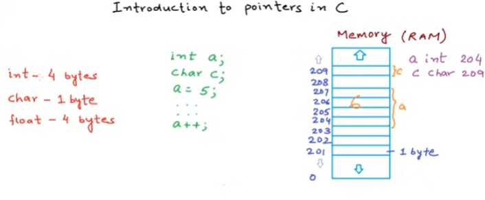
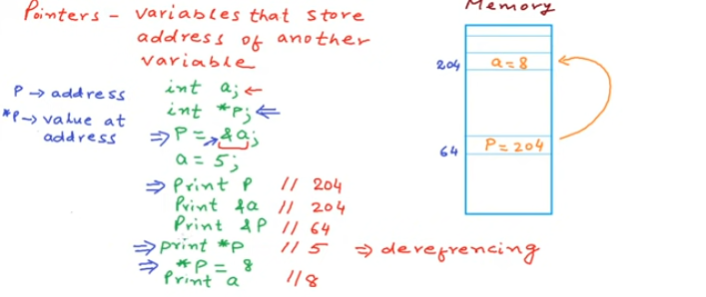
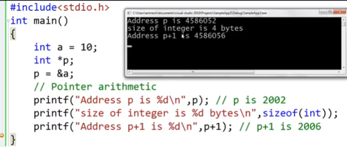
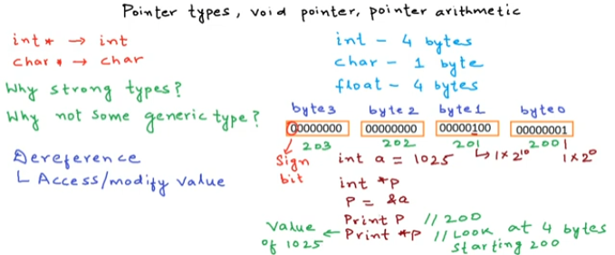

# Poniters in C/C++

<aside>
💡 该笔记是关于C/C++中指针相关知识。所有课程均来自https://www.youtube.com/@mycodeschool，这是我迄今为止看到过最好的指针相关课程，强力推荐！
***Indians came from another planet. Thank you very much for the awesome explanation.***

</aside>

# Introduction to pointers in C/C++

[Episode 1: Introduction to Pointers in C/C++](https://www.youtube.com/watch?v=h-HBipu_1P0&list=PL2_aWCzGMAwLZp6LMUKI3cc7pgGsasm2_&index=2)

要想真正的深入了解指针，我们首先要明确的是，各种数据在计算机中是如何存储的。在计算机中，程序运行时我们定义的数据都是存储在内存中的。内存的最小单元是1字节(1 Byte)，**每一字节的内存单元，都有一个地址与之对应。**上图中右边的201-209代表的就是内存单元的地址。

学过C语言的都知道，每种数据类型都有对应的长度大小，比如`int`类型就是4字节，也就是32位（1Byte=8bit）；`char`类型是1字节，也就是八位。

这里我们分别定义一个`int a` 和`char c` ，那么计算机就会在内存空间中分别为**a和c**分配4字节和1字节的空间，对应图中的**204-207和209两段**。

目前我们明确了数据在内存中是如何存储的，那么我们就可以引入我们今天的主角——***Pointer***

**Pointer又叫指针，是C语言的灵魂所在，懂了指针，你就懂了C语言。**

首先给出指针的定义：一个可以存储任意变量地址的变量。根据这个定义，我们需要明确以下几点：

1. 指针是一个变量，意味着他也需要一块内存空间。(如上图中，指针p对应内存地址为64)
2. 指针变量开辟的内存空间中存储的数据，是其他变量的地址。（如上图中，指针p存储变量a的首地址204，注意这里的204代表的是`a`的首地址，实际上是204-207，后续如果无特殊说明，都以首地址代指）
3. 指针可以指向任意变量的地址，但是指针指向的那个变量是什么类型的，指向他的指针就要是什么类型，需要一一对应。(比如我们想要存储`int`类型变量的地址需要`int`类型的指针，存储`char`类型变量的地址需要`char`类型的指针)
4. 指针的定义：`数据类型 *指针名   ————>  (int *p) or (char *p)`

> `&`：取地址操作，用于获取变量的内存地址。
`*`：解引用操作，用于获取指针指向地址内的值。
> 

# **Working with pointers**

> 这节课主要是上节课理论知识的实操课，非常值得一看。
> 

[Episode 2: Working with Pointers](https://www.youtube.com/watch?v=X1DcpcgSUXw&list=PL2_aWCzGMAwLZp6LMUKI3cc7pgGsasm2_&index=2)

这里提出了一个问题：***p+1结果是什么？***

我们假设此时p=2002，那p+1=2003吗？答案是可能等于，也可能不等于。这取决于指针p的类型。如果p是一个int类型的指针，那么p+1≠2003，而是2006；如果p是一个char类型的指针，那么p+1=2003;

因此 : ***p+1 的结果取决于指针p的具体类型是什么。***

具体情况我们会在下一节具体解释。

# **Pointer types, pointer arithmetic, void pointers**

[Episode 3: Pointer types, pointer arithmetic, void pointers](https://www.youtube.com/watch?v=JTttg85xsbo&list=PL2_aWCzGMAwLZp6LMUKI3cc7pgGsasm2_&index=3)

- 为什么指针是strong types(强类型)？
这是因为指针的类型决定了当我们使用`*p` 进行解引用时，计算机解读指针的方式。
比如上述例子我们定义一个`int a` 并用指针`p`指向`a` ，此时`p`的值为200，这时我们使用`*p` 获得`a` 的值，计算机会将200-203这四个字节的数据看成一个整体进行解读；而如果我们使用一个`char *p` **指向200，使用`*p` ，此时计算机会将200这一个字节看成一个数据；这是因为`int` 类型是4字节长度，而`char` 类型是1字节长度，从而导致指针解读方式不一样。
- genric pointer   `void *p` 
void类型指针可以强转成任意类型指针，但是在强转之前，不能对void类型指针进行**解引用**
和**p+1**操作，因为void类型指针没有一个特定的类型，计算机不知道该按照何种数据类型进行处理。

# **Pointers to Pointers in C/C++**

[Episode 4: Pointers to Pointers in C/C++](https://www.youtube.com/watch?v=d3kd5KbGB48&list=PL2_aWCzGMAwLZp6LMUKI3cc7pgGsasm2_&index=4)
