# 安装Ubuntu

## 1. 预下载

- UltraISO：用于提取镜像中的安装文件
- Ubuntu镜像，这里以[Ubuntu22.04](https://releases.ubuntu.com/22.04/ubuntu-22.04.5-desktop-amd64.iso)为例

## 2. 硬盘分区

右键开始图标，打开磁盘管理

首先将C盘分出一个大小为7GB左右的空间，用来放启动引导。

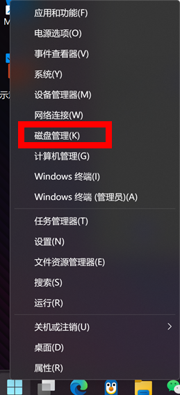

首先右键C盘，点击压缩卷，输入合适的大小，这里以7GB为例，那就是输入7168。（注意，这里分配出来的空间不需要分配磁盘）

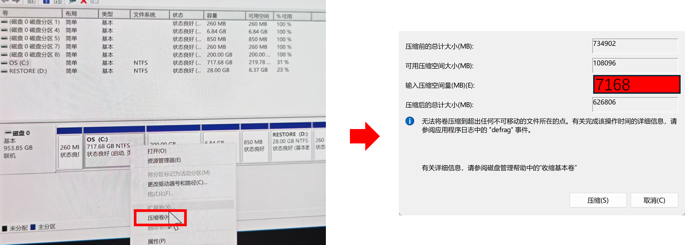

之后是为Ubuntu分配系统空间，过程同上面的操作一样（我因为只有一个硬盘，所以我只分配了200G的空间出来）。需要注意的是，这一步没有要求一定在C盘，你也可以从D盘或者F盘分配200G的空间。

之后将创建出来的200G空间所在的磁盘删除，但不要合并。

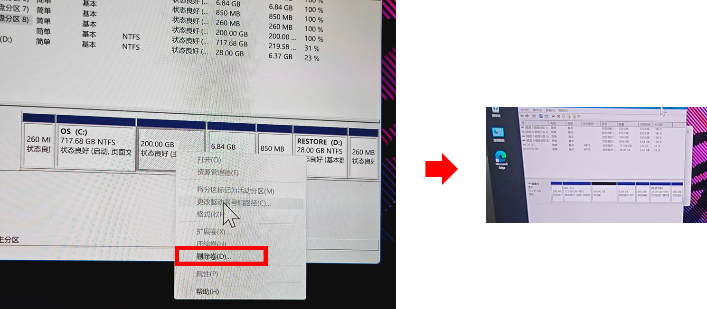

至此，分区创建完毕。

分配好的结果如下：

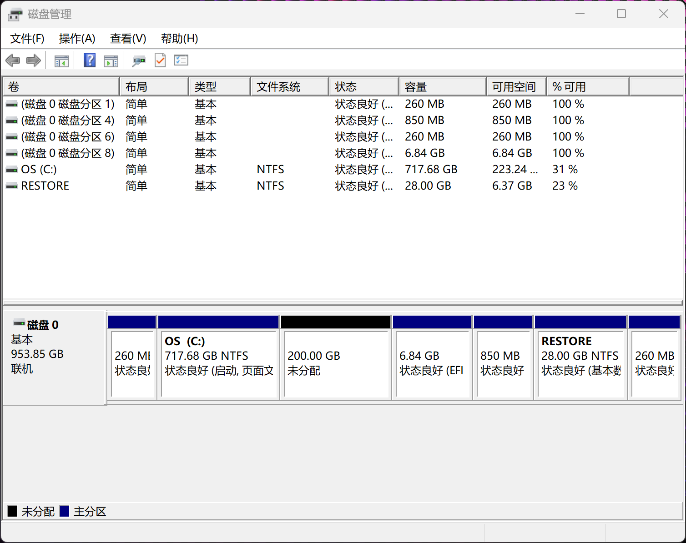

## 3. 设置启动分区

这一步是将我们之前从C盘分出来的启动分区进行一些格式化处理。

首先右键开始菜单，以管理员身份启动Windows终端

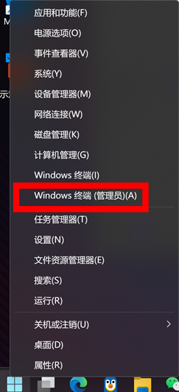

之后在Windows终端上逐步执行如下命令：

```bash
#进入磁盘管理模式
diskpart 

#列出可用磁盘
list disk  

#选中C盘
sel disk 0  

#这里size的大小是之前分出来的大小，我们假设的是7GB 所以这里是7168
#其实为了方便，最开始分区的时候可以直接分出7000
CRE PAR EFI SIZE=7168  

FOR QUICK FS=FAT32 LABEL=“EFI”

ASSIGN LETTER=Y
```

执行完上面这几步之后，你应该能看到一个名字为EFI的硬盘空间，标签为Y

## 4. 设置启动分区

现在要用到UltraISO这个软件，首先右键它，并以管理员身份启动它。

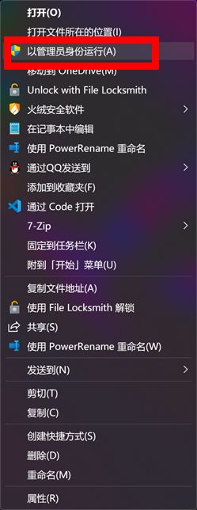

然后点击文件→打开，找到你下载好的镜像文件，进行打开。

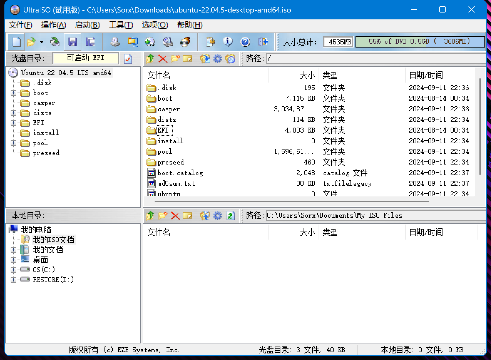

然后右键boot，点击全部选择，全部选择之后再次右键，点击提取到。

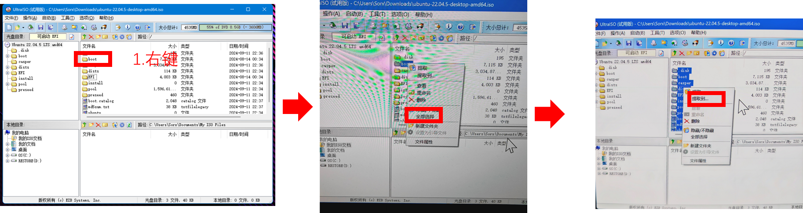

将所有的文件提取到我们之前制作好的启动分区中。

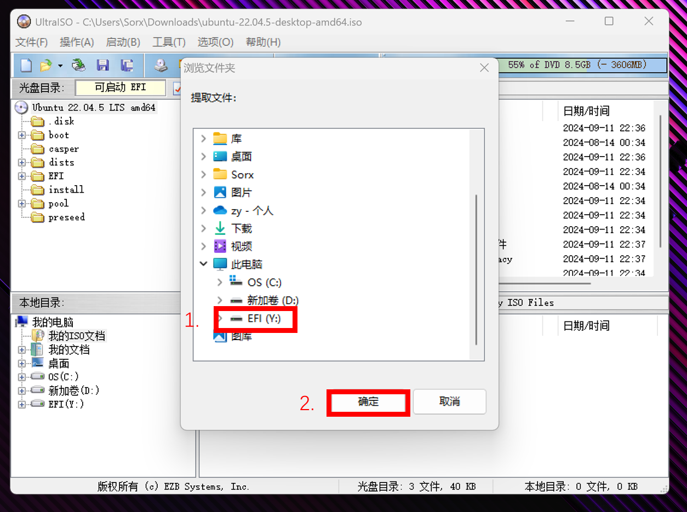

至此启动分区的任务已经全部完成。

## 5. 关闭安全启动

打开控制面板，按照如下操作，将`启用快速启动关闭`（取消勾选启用快速启动）

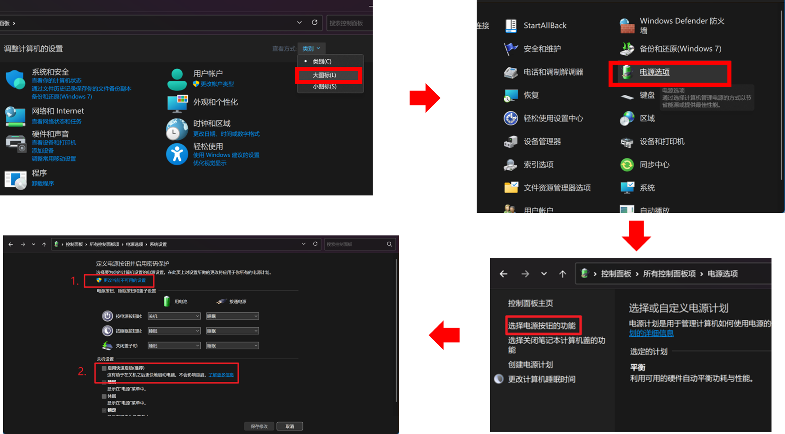

之后关机再开机，进入BIOS模式（每个机器不同，我的是按住F2进入）

首先将UEFI OS拖动到第一

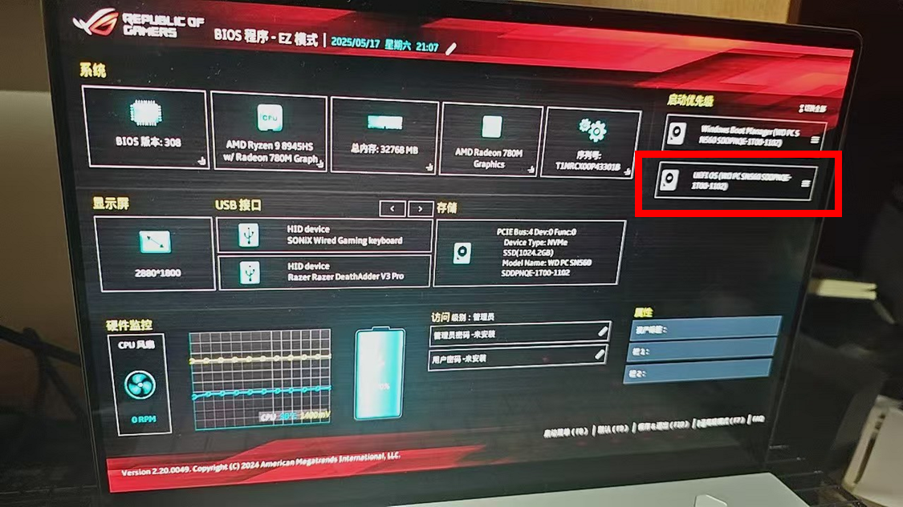

然后按下F7进入高级设置，点击安全性，将安全启动设置为关闭。

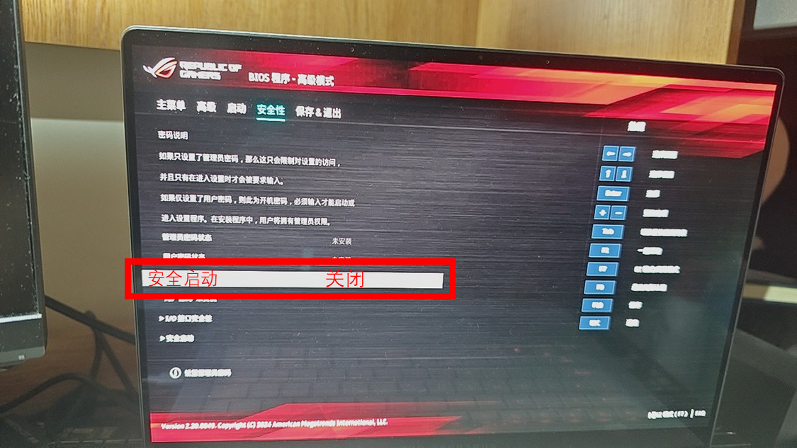

然后点击启动，将快速启动改为关闭。

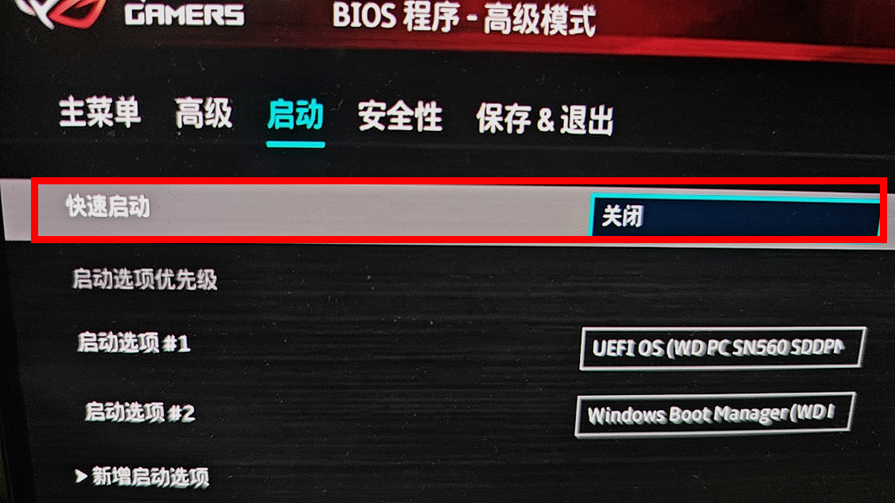

之后F10保存并退出。

至此，关闭安全启动全部完成。

## 6. 安装Ubuntu

F10保存退出后，会进入启动管理界面，回车选择Try or Install Ubuntu

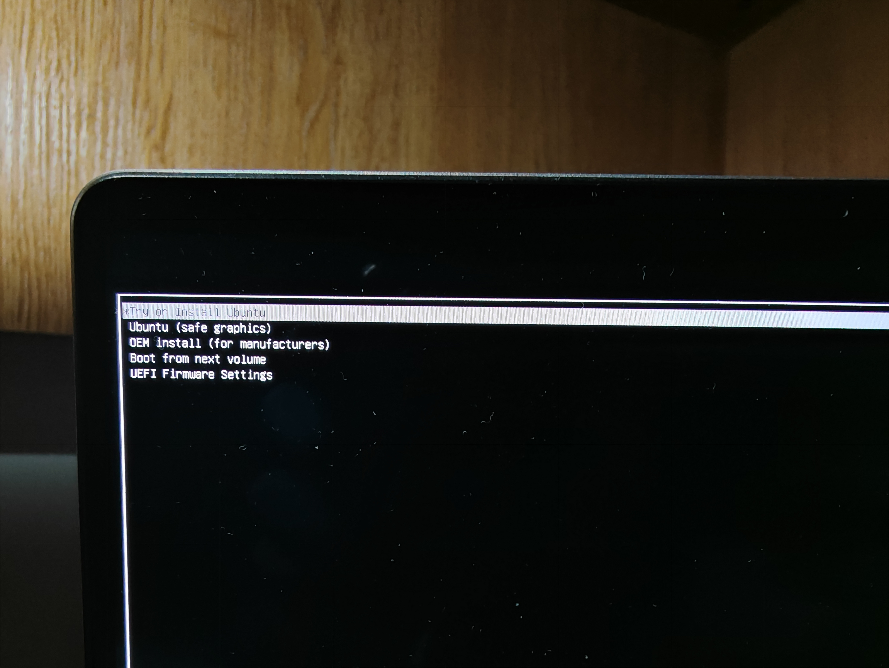

然后会进入安装界面，一直选择默认安装即可。

安装的时候选择不链接wifi。

当出现以下界面时，找到提供的200G空间，双击它，然后挂载点选择/，之后点击OK，再点击现在安装。之后进行默认操作即可完成安装。

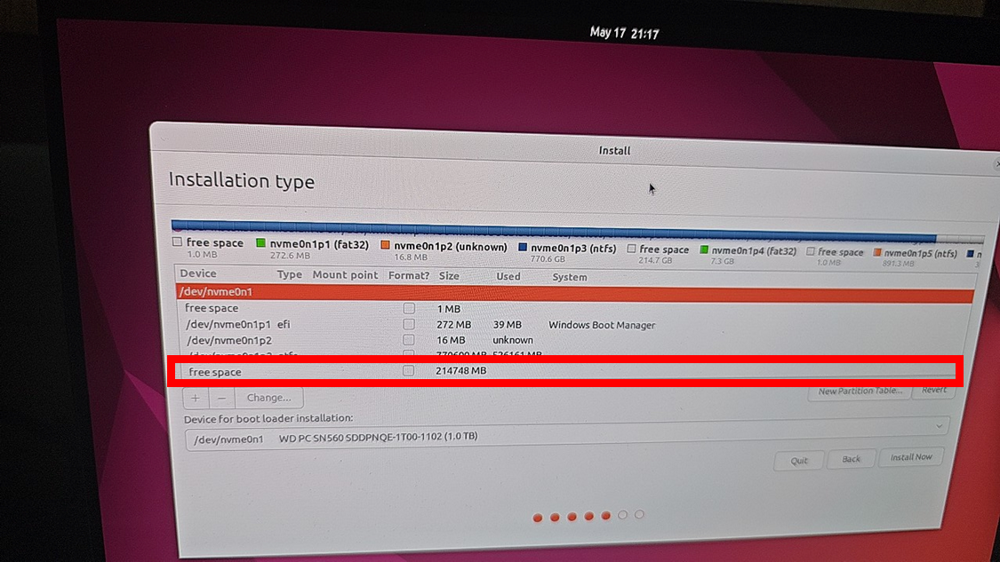
