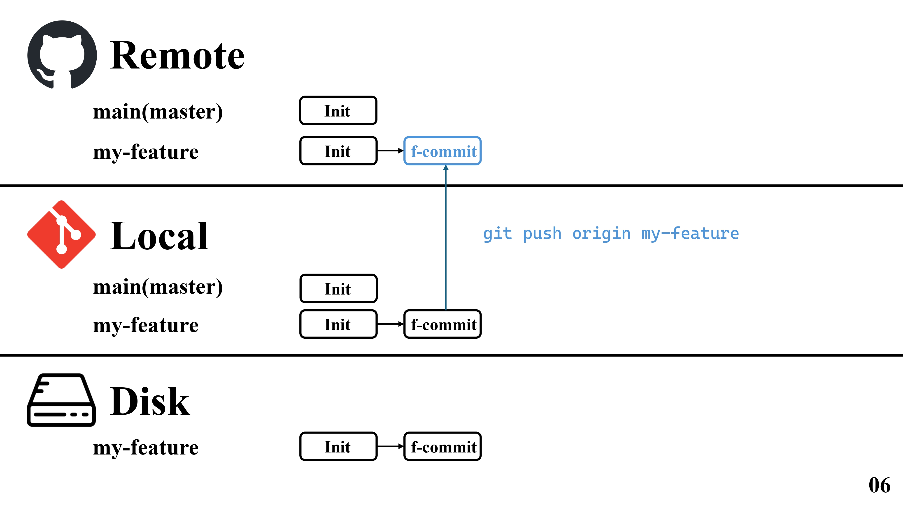

# GitHub极简工作流


第一步我们先从远端（Remote，也就是GitHub）拉去仓库到本地。


之后，我们首先在本地创建一个新的分支my-feature,这样做的好处是我们在本地分支上修改我们的代码，而不会“污染”main分支的代码。


完成修改之后，我们可以使用`git diff` 命令来查看我们的修改内容。


之后，我们使用`git add <changed_file>` 命令，将修改过的文件添加到暂存区。


然后执行`git commit` 命令提交我们的修改。



之后使用`git push origin my-feature` 命令`push` 我们的修改到远端仓库，这时候我们的远端仓库会出现一个新的分支`my-feature`。


正常情况下，如果是个人项目推送上去之后直接merge就可以了。但是稍微大一点的项目，就会出现，在你推送上去的时候，main分支会有一个新的update，这个时候你需要自己在本地合并update和你的my-feature，检查没有问题之后再重新推送。


所以，你要先在本地使用`git checkout main` 命令切换到本地的main分支。


然后使用`git pull origin main` 重新拉取update到本地。这个时候本地的main分支已经到最新。


之后使用`git checkout my-feature` 切换回自己的my-feature分支。


然后使用`git rebase main` 命令，将update分支同步到my-feature上，并合并冲突项。


修改完成之后，我们要重新push到我们远端的my-feature上。注意这时候我们要使用`git push -f origin my-feature` ，原因是我们在本地的f-commit之前，重新同步了update分支，而远端的my-feature分支没有同步，如果不加`-f` 会出现推送不成功。


完成这些之后，我们就可以向仓库所有者提出`pull request` 。


之后，仓库所有者会进行`squash and merge`。为什么要执行这个操作而不是直接merge，这是因为在一个正规项目里，可能会有很多分支请求merge，但是我们为了让main分支上的更新尽可能的简约，需要对很多分支的请求进行合并。完成合并之后，main分支上会出现一个新的分支update2。


之后，我们需要删除掉远端的my-feature分支，然后在本地使用`git checkout main` 切换回`main` 分支。


之后使用`git branch -D my-feature` 删除掉local git中的my-feature分支。


最后的最后，我们重新使用`git pull origin master` 同步远端的最新main分支到本地。

## SSH验证登陆

我们可以使用ssh来push我们的代码，这样安全且方便。

首先我们配置好git的用户名和邮箱。

```bash
git config --global user.name "your name"
git config --global user.email "you email"
```

下一步我们生成sshkey

```bash
ssh-keygen -t ed25519 -C "your email"
# 会有如下输出：
# 这其中passphrase是你的ssh密码，如果不想设置可以直接回车
Generating public/private ed25519 key pair.
Enter file in which to save the key (/Users/sorx/.ssh/id_ed25519):
Enter passphrase for "/Users/sorx/.ssh/id_ed25519" (empty for no passphrase):
Enter same passphrase again:
# 设置完成之后，这里会生成两个文件，其中id_ed25519.pub文件中就存着我们需要的内容。
Your identification has been saved in /Users/sorx/.ssh/id_ed25519
Your public key has been saved in /Users/sorx/.ssh/id_ed25519.pub
The key fingerprint is:
SHA256:nrL8d1LqRqopoTmmEs1js7HjCfJ8wgJFzXhgcTLgSOI xiezy3@gmail.com
The key's randomart image is:
+--[ED25519 256]--+
|oo**.            |
|*.o++            |
|.E .             |
|  .              |
| +      S        |
|o B .  . .. .    |
|++ O .. oo o     |
|++@.o. +. = .    |
|o=== .=o.+.o     |
+----[SHA256]-----+
```

之后找到id_ed25519.pub这个文件，路径在上面的提示中有。

里面的内容是


然后我们复制里面的全部内容。

打开GitHub。

找到settings→SSH and GPG keys.


点击New SSH Key。


填入一个title，便于告诉自己这个ssh key是用在哪台设备上的。比如：Windows-ssh-key

然后将id_ed25519.pub中的内容全部复制到Key中去，最后点击Add SSH Key即可。

添加完成后，回到terminal，测试是否添加成功。

在终端中输入下面的内容

```bash
ssh -T git@github.com

# 如果看到下面的内容，代表添加成功。
Hi [your name]! You've successfully authenticated, but GitHub does not provide shell access.
```

## 本地与远程仓库同步

### Step1

确保本地代码已提交。

在合并前，确保本地所有的修改都已经`commit`了。

```bash
git add .
git commit -m "Initial commit"
```

### Step2

将本地分支重命名为main。

Github现在默认主分支是`main`，而有些可能是`master`。

```bash
git branch -M main
```

### Step3

将远程仓库地址添加为本地远程仓库。

```bash
git remote add origin <你的GitHub仓库URL>
```

### Step4

拉取远程代码并合并。

因为远程仓库可能有`LICENSE`和`.gitignore`，如果本地没有的话，直接`pull`会报错。

```bash
git pull origin main --allow-unrelated-histories --no-rebase
```

**可能发生的情况：**

1. **自动成功：** 如果你本地没有同名文件，git 会自动把 GitHub 上的 LICENSE 和 .gitignore 下载下来并生成一个新的合并 commit。
2. **冲突 (Conflict)：** 如果你本地也写了一个 `.gitignore` 文件，git 会提示冲突。你需要打开 `.gitignore`，手动保留你需要的内容，然后再次 `git add .gitignore` 和 `git commit`。

### Step5

最后提交。

```bash
git push -u origin main
```

`-u`是`--set-upstream`的缩写。

它的作用是：绑定，记住默认路线。

如果你**不加** `-u`： 每次你想推送或拉取代码，你都必须写全：

- `git push origin main`
- `git pull origin main`

如果你**加了** `-u`（只需要加一次）： 以后你就可以直接输入简短的命令，Git 就会自动去刚才绑定的那个远程分支：

- **`git push`** (Git 知道默认推送到 `origin main`)
- **`git pull`** (Git 知道默认从 `origin main` 拉取)