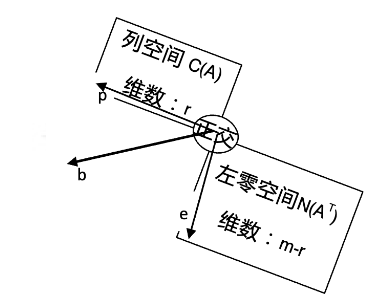
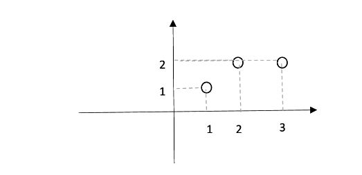

# [Lecture 16: Projection matrices and least squares](https://ocw.mit.edu/courses/18-06-linear-algebra-spring-2010/resources/lecture-16-projection-matrices-and-least-squares/)

## 投影矩阵

投影矩阵 $P = A(A^TA)^{-1}A^T$，其物理意义是将向量 $b$ 投影到 $A$ 的列空间中。

投影有两种极限情况：

- 如果 $b$ 本身就在 $A$ 的列空间中，那么 $Pb = b$，此时 $P = I$\
证明：\
因为 $b$ 在 $A$ 的列空间，有 $Ax=b$。
带入投影矩阵 $Px = A(A^TA)^{-1}A^Tx=A(A^TA)^{-1}A^TAx=A(A^TA)^{-1}(A^TA)x=Ax=b$
- 如果 b 垂直于列空间，此时根据正交补的概念，b 是 $A$  左零空间的向量，有 $Pb = 0$ 且 $A^Tb = 0$

**综上可以归纳：任意向量 b 都可以拆解成两个分量，一个分量 p 在 A 的列空间中，另一分量 e 在 A 的左零空间中。**

$p$  是投影矩阵 $P$ 作用于 $b$ 在  $A$  列空间的投影得到的分量，同理，如果想要投影到左零空间，那么投影矩阵就应该是 $I−P$。

> 因为$p=Pb,e=b−p$，所以$e=b−Pb=(I−P)b$。
> 

## 再探最小二乘

还是回到例题：平面上三个点 $(1,1),(2,2),(3,2)$ 做线性回归。

上一节我们分别通过微积分和投影矩阵两种方法进行了拟合，最终发现所求解的方程完全一致。实际上，在微积分求解法中，我们本质上算的是误差向量$e_1,e_2,e_3$模的平方和，为了让平方和最小，通过求导数找极值的方式列出了求解方程。

而在投影法中，投影的本质其实就是将向量$b$投影到$A$列空间中最近的一点，换句话说，就是把$p_1,p_2,p_3$分别投影到所需求解的直线上去。

**因此，微积分算最小二乘(least square)和投影矩阵具有相同的内核，也就不难理解为何二者最终需求解的解方程组殊途同归了。**

最终我们求得$y=\frac{1}{2}x+\frac{2}{3}$，得到:$b=\begin{bmatrix}1\\2\\2\end{bmatrix}$,$p=\begin{bmatrix}\frac{7}{6}\\\frac{10}{6}\\\frac{13}{6}\end{bmatrix}$,$e=\begin{bmatrix}-\frac{1}{6}\\\frac{2}{6}\\-\frac{1}{6}\end{bmatrix}$

简单验证一下，可以发现$e$与$p$垂直。

我们可以得到如下性质：

- 误差向量 $e$ 与投影向量 $p$ 垂直。
- 误差向量 $e$ 不仅与 投影向量 $p$ 垂直，并且与列空间中的每一个向量都垂直。

<aside>
💡 这里我们要证明一下之前提到过的一个定理：

**如果 $A$ 的各列线性无关，那么$A^TA$ 是可逆的。**

 写出零空间方程的形式：$A^TAx=0$，寻找零空间内的向量。

前面几节我们讨论过：

- 如果矩阵可逆，则其对应的零空间仅包含零向量。
- $x^Tx$对应是在求 $x$ 的长度（$x$为列向量）
- 如果$x^Tx=0$，则 $x = 0$（$x$是列向量）

如此，我们只要证明在$A^TAx=0$ 方程中，$x$ 仅为零向量。

我们将方程两边同时乘上 $x^T$，

$$
x^TA^TAx=0\\(Ax)^TAx=0
$$

可得：

$$
Ax = 0
$$

又因为 $A$ 的各列线性无关，所以 $x$ 必为零向量，因此 $A^TA$ 一定可逆。

</aside>

## 标准正交基

互相垂直的各列一定是线性无关的。于是，我们可以找到空间里的一组基，它们彼此相互垂直，这组基我们称之为正交基。

参考三维直角坐标系，我们常常选用$\begin{bmatrix}1\\0\\0\end{bmatrix}，\begin{bmatrix}0\\1\\0\end{bmatrix}，\begin{bmatrix}0\\0\\1\end{bmatrix}$作为标准基，也就是对应x,y,z三个轴。

- 由于彼此相互垂直，故为一组正交基。
- 由于每个基向量都是单位向量，故称作标准正交基。

当然，标准正交基不止这一种，例如二维空间的标准正交基还可以是：$\begin{bmatrix}\cos\theta\\\sin\theta\end{bmatrix},\begin{bmatrix}-\sin\theta\\\cos\theta\end{bmatrix}$。