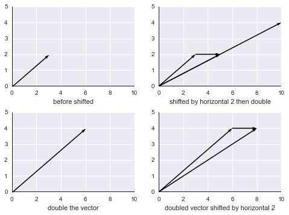
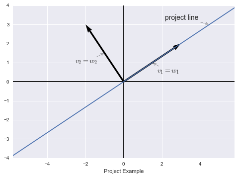

# [Lecture 30: Linear transformations and their matrices](https://ocw.mit.edu/courses/18-06-linear-algebra-spring-2010/resources/lecture-30-linear-transformations-and-their-matrices/)

如何判断一个操作是不是线性变换？线性变换需满足以下两个要求：

$$
⁍
$$

即变换T需要同时满足加法和数乘不变的性质。将两个性质合成一个式子为：

$$
T(cv+dw)=cT(v)+dT(w)
$$

例1，二维空间中的投影操作，$T:\mathbb{R}^2\to\mathbb{R}^2$，它可以将某向量投影在一条特定直线上。检查一下投影操作，如果我们将向量长度翻倍，则其投影也翻倍；两向量相加后做投影与两向量做投影再相加结果一致。所以投影操作是线性变换。

“坏”例1，二维空间的平移操作，即平面平移：

比如，上图中向量长度翻倍，再做平移，明显与向量平移后再翻倍的结果不一致。

有时我们也可以用一个简单的特例判断线性变换，检查$T(0) \stackrel{?}{=}0$
。零向量平移后结果并不为零。

所以平面平移操作并不是线性变换。

“坏”例2，求模运算，$T(v)=∥v∥, T:\mathbb{R}^3\to\mathbb{R}^1$，这显然不是线性变换，比如如果我们将向量翻倍则其模翻倍，但如果我将向量翻倍取负，则其模依然翻倍。所以$T(-v)\neq-T(v)$

例2，旋转$45\degree$操作，$T:\mathbb{R}^2\to\mathbb{R}^2$，也就是将平面内一个向量映射为平面内另一个向量。检查可知，如果向量翻倍，则旋转后同样翻倍；两个向量先旋转后相加，与这两个向量先相加后旋转得到的结果一样。

所以从上面的例子我们知道，投影与旋转都是线性变换。

例3，矩阵乘以向量，$T(v)=Av$，这也是一个（一系列）线性变换，不同的矩阵代表不同的线性变换。根据矩阵的运算法则有$A(v+w)=A(v)+A(w), A(cv)=cAv$。比如取$A=\begin{bmatrix}1&0\\0&-1\end{bmatrix}$，作用于平面上的向量$v$，会导致$v$的$x$分量不变，而$y$分量取反，也就是图像沿$x$轴翻转。

线性变换的核心，就是该变换使用的相应的矩阵。

比如我们需要做一个线性变换，将一个三维向量降至二维，$T:\mathbb{R}^3\to\mathbb{R}^2$，则在$T(v)=Av$中，$v\in\mathbb{R}^3,T(v)\in\mathbb{R}^2$，所以$A$应当是一个$2×3$矩阵。

如果我们希望知道线性变换$T$对整个输入空间$\mathbb{R}^n$的影响，我们可以找到空间的一组基$v_1,v_2,\cdots,v_n$，检查$T$对每一个基的影响$T(v_1),\mathrm{~}T(v_2),\mathrm{~}\cdots,T(v_n)$，由于输入空间中的任意向量都满足：

$$
⁍
$$

所以我们可以根据T(v)推出线性变换T对空间内任意向量的影响，得到：

$$
⁍
$$

现在我们需要考虑，如何把一个与坐标无关的线性变换变成一个与坐标有关的矩阵呢？

在$1$式中，$c_1,c_2,\cdots,c_n$就是向量$v$在基$v_1,v_2,\cdots,v_n$上的坐标，比如分解向量$v=\begin{bmatrix}3\\2\\4\end{bmatrix}=3\begin{bmatrix}1\\0\\0\end{bmatrix}+2\begin{bmatrix}0\\1\\0\end{bmatrix}+4\begin{bmatrix}0\\0\\1\end{bmatrix}$，式子将向量$v$分解在一组标准正交基$\begin{bmatrix}1\\0\\0\end{bmatrix},\begin{bmatrix}0\\1\\0\end{bmatrix},\begin{bmatrix}0\\0\\1\end{bmatrix}$上。当然，我们也可以选用矩阵的特征向量作为基向量，基的选择是多种多样的。

我们打算构造一个矩阵$A$用以表示线性变换$T:\mathbb{R}^n\to\mathbb{R}^m$。我们需要两组基，一组用以表示输入向量，一组用以表示输出向量。令$v_1,v_2,\cdots,v_n$为输入向量的基，这些向量来自$\mathbb{R}^n$；$w_1,w_2,\cdots,w_m$作为输出向量的基，这些向量来自$\mathbb{R}^m$。

我们用二维空间的投影矩阵作为例子：

从图中可以看到，设输入向量的基为$v_1,v_2$，$v_1$就在投影上，而$v_2$垂直于投影方向，输出向量的基为$w_1,w_2$，而$v_1=w_1,v_2=w_2$。那么如果输入向量为$v=c_1v_1+c_2v_2$，则输出向量为$T(v)=c_1v_1$，也就是线性变换去掉了法线方向的分量，输入坐标为$(c1,c2)$，输出坐标变为$(c1,0)$。

找出这个矩阵并不困难，$Av=w$，则有$\begin{bmatrix}1&0\\0&0\end{bmatrix}\begin{bmatrix}c_1\\c_2\end{bmatrix}=\begin{bmatrix}c_1\\0\end{bmatrix}$。

本例中我们选取的基极为特殊，一个沿投影方向，另一个沿投影法线方向，其实这两个向量都是投影矩阵的特征向量，所以我们得到的线性变换矩阵是一个对角矩阵，这是一组很好的基。

所以，如果我们选取投影矩阵的特征向量作为基，则得到的线性变换矩阵将是一个包含投影矩阵特征值的对角矩阵。

继续这个例子，我们不再选取特征向量作为基，而使用标准基$v_1=\begin{bmatrix}1\\0\end{bmatrix},v_2=\begin{bmatrix}0\\1\end{bmatrix}$，我们继续使用相同的基作为输出空间的基，即$v_1=w_1,v_2=w_2$。此时投影矩阵为$P=\frac{aa^T}{a^Ta}=\begin{bmatrix}\frac{1}{2}&\frac{1}{2}\\\\\frac{1}{2}&\frac{1}{2}\end{bmatrix}$，这个矩阵明显没有上一个矩阵“好”，不过这个矩阵也是一个不错的对称矩阵。

总结通用的计算线性变换矩阵A的方法：

- 确定输入空间的基$v_1,v_2,\cdots,v_n$，确定输出空间的基$w_1,w_2,\cdots,w_m$；
- 计算$T(v_1)=a_{11}w_1+a_{21}w_2+\cdots+a_{m1}w_m$，求出的系数$a_{i1}$就是矩阵$A$ 的第一列；
- 继续计算$T(v_2)=a_{12}w_1+a_{22}w_2+\cdots+a_{m2}w_m$，求出的系数$a_{i2}$就是矩阵$A$ 的第二列；
- 以此类推计算剩余向量直到$v_{n}$；
- 最终得到矩阵$A=\begin{bmatrix}a_{11}&a_{12}&\cdots&a_{1n}\\a_{21}&a_{22}&\cdots&a_{2n}\\\vdots&\vdots&\ddots&\vdots\\a_{m1}&a_{m2}&\cdots&a_{mn}\end{bmatrix}$。

最后我们介绍一种不一样的线性变换，$T=\frac{\mathrm{d}}{\mathrm{d}x}$：

- 设输入为$c_1+c_2x+c_3x^3$，基为$1,x,x^{2}$；
- 则输出为导数：$c_2+2c_3x$，基为$1,x$；
    
    所以我们需要求一个从三维输入空间到二维输出空间的线性变换，目的是求导。求导运算其实是线性变换，因此我们只要知道少量函数的求导法则（如$\sin x,\cos x,e^x$），就能求出它们的线性组合的导数。
    
    有$A\begin{bmatrix}c_1\\c_2\\c_3\end{bmatrix}=\begin{bmatrix}c_2\\2c_3\end{bmatrix}$，从输入输出的空间维数可知，$A$是一个$2×3$矩阵，$A=\begin{bmatrix}0&1&0\\0&0&2\end{bmatrix}$。
    

最后，矩阵的逆相当于对应线性变换的逆运算，矩阵的乘积相当于线性变换的乘积，实际上矩阵乘法也源于线性变换。