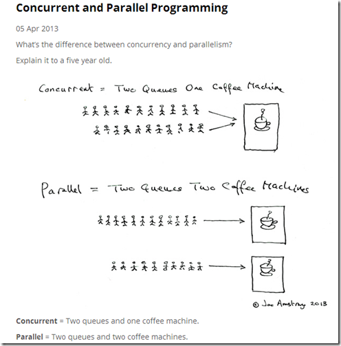

# 并发和并行

上图很直观的体现了：

- **并发(Concurrent)** 是多个队列使用同一个咖啡机，然后两个队列轮换着使用（未必是 1:1 轮换，也可能是其它轮换规则），最终每个人都能接到咖啡
- **并行(Parallel)** 是每个队列都拥有一个咖啡机，最终也是每个人都能接到咖啡，但是效率更高，因为同时可以有两个人在接咖啡

当然，我们还可以对比下串行：只有一个队列且仅使用一台咖啡机，前面哪个人接咖啡时突然发呆了几分钟，后面的人就只能等他结束才能继续接。

我们可能会有疑问，并发不也存在上面的问题吗？前面的人发呆几分钟怎么办？很简单，另一个队列的人把他推开就可以了。

在这里给出一个结论：**并发和并行都是对“多任务”处理的描述，其中并发是轮流处理，而并行是同时处理**。

## CPU多核

CUP的核心可以类比成上面的咖啡机。

### 单核心并发

只有一个核心时，我们使用的是操作系统多线程+CPU核心，由他们实现了现代化的多任务操作系统。

在OS级别，多线程负责管理任务队列，可以简单的认为一个线程管理着一个任务队列，然后线程之间还能根据空闲度进行任务调度。我们的程序只会跟OS线程打交道，并不关系CPU具体有多少个核心。

当线程把任务交给CPU处理时，如果只有一个核心，那么它就只能同时处理一个任务。

和排队一样，假如某个任务执行时间过长，就会导致用户界面的假死（相信使用 Windows 的同学或多或少都碰到过假死的问题），那么就需要 CPU 的任务调度了（真实 CPU 的调度很复杂，我们这里做了简化），有一个调度器会按照某些条件从队列中选择任务进行执行，并且当一个任务执行时间过长时，会强行切换该任务到后台中（或者放入任务队列，真实情况很复杂！），去执行新的任务。

不断这样的快速任务切换，对用户而言就实现了表面上的多任务同时处理，但是实际上最终也只有一个 CPU 核心在不停的工作。

因此并发的关键在于：**快速轮换处理不同的任务**，给用户带来所有任务同时在运行的假象。

### 多核心并行

当 CPU 核心增多到 `N` 时，那么同一时间就能有 `N` 个任务被处理，那么我们的并行度就是 `N`，相应的处理效率也变成了单核心的 `N` 倍（实际情况并没有这么高）。

### 多核心并发

当核心增多到 `N` 时，操作系统同时在进行的任务肯定远不止 `N` 个，这些任务将被放入 `M` 个线程队列中，接着交给 `N` 个 CPU 核心去执行，最后实现了 `M:N` 的处理模型，在这种情况下，**并发与并行是同时在发生的，所有用户任务从表面来看都在并发的运行，但实际上，同一时刻只有 `N` 个任务能被同时并行的处理**。

## 定义

如果某个系统支持两个或者多个动作的**同时存在**，那么这个系统就是一个并发系统。如果某个系统支持两个或者多个动作**同时执行**，那么这个系统就是一个并行系统。并发系统与并行系统这两个定义之间的关键差异在于**“存在”**这个词。

在并发程序中可以同时拥有两个或者多个线程。这意味着，如果程序在单核处理器上运行，那么这两个线程将交替地换入或者换出内存。这些线程是**同时“存在”**的——每个线程都处于执行过程中的某个状态。如果程序能够并行执行，那么就一定是运行在多核处理器上。此时，程序中的每个线程都将分配到一个独立的处理器核上，因此可以同时运行。

相信你已经能够得出结论——**“并行”概念是“并发”概念的一个子集**。

## 编程语言的并发模型

如果大家学过其它语言的多线程，可能就知道不同语言对于线程的实现可能大相径庭：

- 由于操作系统提供了创建线程的 API，因此部分语言会直接调用该 API 来创建线程，因此最终程序内的线程数和该程序占用的操作系统线程数相等，一般称之为**1:1线程模型**，例如 Rust。
- 还有些语言在内部实现了自己的线程模型（绿色线程、协程），程序内部的 M 个线程最后会以某种映射方式使用 N 个操作系统线程去运行，因此称之为**M:N 线程模型**，其中 M 和 N 并没有特定的彼此限制关系。一个典型的代表就是 Go 语言。
- 还有些语言使用了 Actor 模型，基于消息传递进行并发，例如 Erlang 语言。

总之，每一种模型都有其优缺点及选择上的权衡，而 Rust 在设计时考虑的权衡就是运行时(Runtime)。出于 Rust 的系统级使用场景，且要保证调用 C 时的极致性能，它最终选择了尽量小的运行时实现。

而绿色线程/协程的实现会显著增大运行时的大小，因此 Rust 只在标准库中提供了`1:1`的线程模型，如果你愿意牺牲一些性能来换取更精确的线程控制以及更小的线程上下文切换成本，那么可以选择 Rust 中的 `M:N` 模型，这些模型由三方库提供了实现，例如大名鼎鼎的 `tokio`。

<aside>
💡

运行时是那些会被打包到所有程序可执行文件中的 Rust 代码，根据每个语言的设计权衡，运行时虽然有大有小（例如 Go 语言由于实现了协程和 GC，运行时相对就会更大一些），但是除了汇编之外，每个语言都拥有它。小运行时的其中一个好处在于最终编译出的可执行文件会相对较小，同时也让该语言更容易被其它语言引入使用。

</aside>